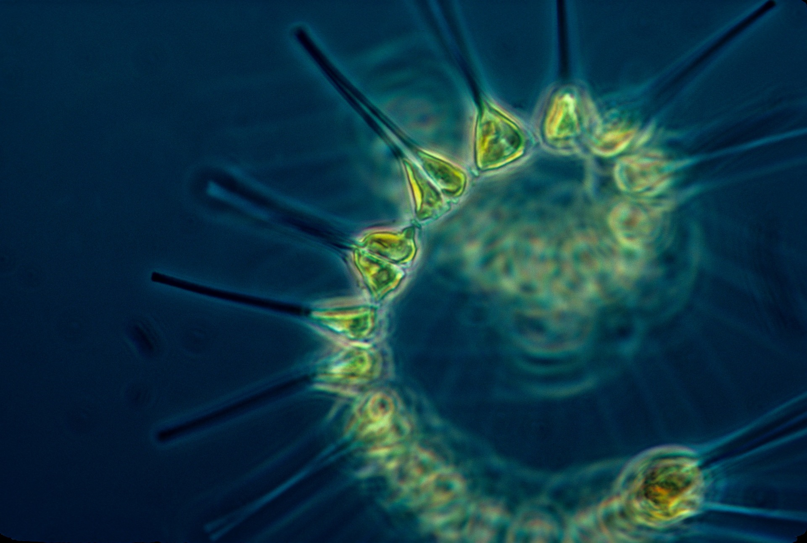

# Hackaton_Hack_The_Ocean

**Proyecto para el Hackaton "Hack The Ocean" de LaunchX**

**Tema:** "*El verdadero pulmón del planeta está en los océanos"*

**Nombre del equipo:** O.K Dev ("Ocean Keepers Developers")

**Integrantes:** 

Marco Vinicio Castro Heredia.

David Albino Granados.

Erick Jaziel Ortiz.

**Propósito del proyecto:** Concientizar en las personas la importancia del fitoplancton en la vida de todos los seres vivos, informando sobre el papel vital que tienen en la producción de oxígeno del planeta.

El fitoplancton (y no los bosques) producen entre el 50% y el 85 % del oxígeno del planeta. 

**Son la base de los ecosistemas acuáticos al realizar fotosíntesis** .

 Sin embargo, **la actividad humana, el calentamiento global y los contaminantes vertidos en el mar representan un peligro para la vida.**

En nuestro proyecto no solo hacemos mensión del problema, además damos sugerencias sobre como contribuir a la conservación del fitoplancton y por lo tanto de la vida en general.

**Recomendaciones para evitar la contaminación del mar y océanos**

* **Disminuir el consumo de productos de plástico**.
* **Comprar de un modo sostenible.**
* **No tirar basura en las playas.**
* **Reducir el consumo energético y las emisiones de CO2.**
* **Apoyar a organizaciones dedicadas a atacar esta problemática.**

**Nuestra propuesta**

El fitoplancton es el ser vivo que más oxígeno libera a la atmósfera por lo tanto proponemos un plan para promover en las playas el uso de cestos grandes de PET, con la forma de algún animal o personaje popular con alguna frase “Cuidando el mar, cuidas el planeta”, y una vez llenos estos cestos de PET convertirlos en la escultura que tenía el cesto en donde se depositó, así le damos un uso de utilidad, concientizamos a las personas, contribuimos en cierto grado a evitar la contaminación de playas y mares.
